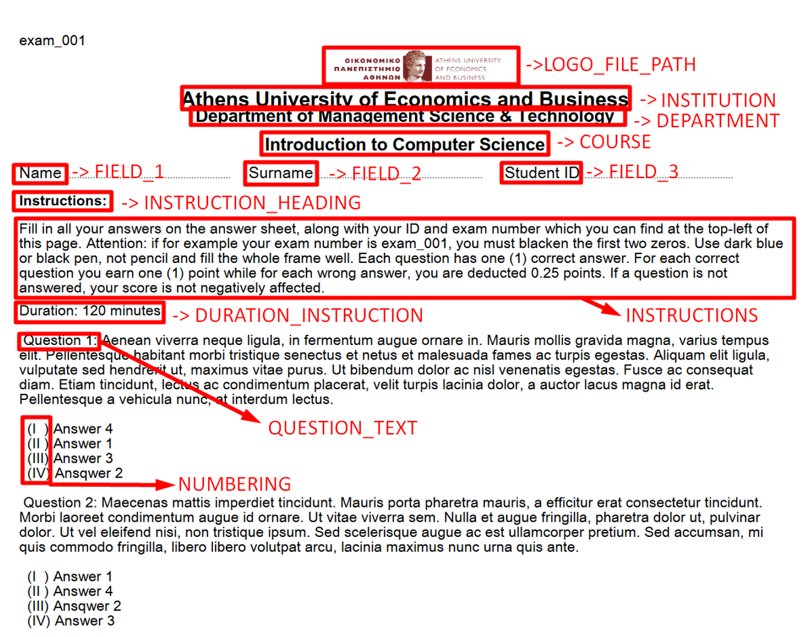

# python-exam-generator
A dynamic multiple choise exam generator using python

## Installation and running

### Prerequisites

* Python 3
* PyFPDF: `pip install fpdf`

At first clone the repo (or download release):

    git clone https://github.com/gliargovas/python-exam-generator.git
    
### Question file
    
The structure of your exam is specified by a question file that contains the different
questions of the exam. The path of the question file is specified in the **configuration file**.

The questions csv file is comma (`,`) delimited.

Also, use double quotation marks when specifying text.

The general format of the exam is the following:

| Category  |  Question | Option 1 | Option 2 | ... | Option n | Correct option | Image path |
| ------------- | ------------- | ------------- | ------------- | ------------- | ------------- | ------------- | ------------- |
| Countries  |  "Which country is NOT located in Europe?" | Malta | Greenland | ... | United Kingdom | 2 |  |
| Countries  |  "Which country is NOT located in North America?" | Germany | United States | ... | United Kingdom | 1 |  |
| Flags  |  "Which country's flag is this?" | Greece | Greenland | ... | Germany | 2 | images/greek-flag.png |
| ... | ... | ... | ... | ... | ... | ... | ... | ... | ... | ... | ... |

***Note:*** Questions may have a different number of possible options but only one correct answer.

### Configuration file

The exam generator's properties are specified in the `./config.txt` file, located in the root directory.

All the fields in the configuration file follow the below format:

    <FIELD>=<VALUE> or <FIELD>:<VALUE>

The configutation file is split into two sections and consists of the following options:

#### Section 1: Exam generation
This section consists of fields regarding the way the exam is generated. This includes the following:

`QUESTION_FILE`: The relative or absolute path of the question file.

`CATEGORIZE_QUESTIONS`: Either **True** or **False**. Take into account the question category field. Each category has the same number of questions. If questions are categorized, the number of questions is the quotient of the number of questions divided by the distinct number of categories

`NUMBER_OF_QUESTIONS`: **Integer** number. The number of questions to be included in the exam. If categorization is not taken into consideration, the actual number of the questions is the same as the number specified. If categorization is taken into consideration, the number of questions is the quotient of the number of questions divided by the distinct number of categories. Must be less than or equal to the number of questions provided in the question file.

`RANDOM_SAMPLING`: Either **True** or **False**. Pick random questions from the questions file. If categorization is specified, the same number of questions is selected for each category.

`NUMBER_OF_EXAMS`: **Integer** number. The number of exams to be generated. Either identical or distinct.

`SHUFFLE_QUESTIONS`: Either **True** or **False**. Randomize the order which the questions appear.

`SHUFFLE_OPTIONS`: Either **True** or **False**. Randomize the order which the question options appear.

`PAGES`: **Integer** number. Number of pages for each exam. If the number is greater than the exam questions actually occupy, blank pages are inserted to match the number specified. This should be used if you are planning to print the exams and require a fixed number of pages. 

`GENERATE_ANSWERS`: Either **True** or **False**. Generate an additional PDF file with the correct answers marked.

`SEED`: **Integer** number. The random seed to use for exam generation.

`VERBOSE`: Either **True** or **False**. Prints detailed messages.

#### Section 2: Exam design

This section consists of fields regarding the printed messages of the exams. This includes the following:

`LOGO_FILE_PATH`: The absolute or relative path for the logo file. If no path is specified, it is left blank.

`INSTITUTION`: The name of the institution.

`DEPARTMENT`: The name of the department.

`COURSE`: The name of the course.

`FIELD_1`, `FIELD_2` AND `FIELD_3`: Fields about student identification information.

`INSTRUCTION_HEADING`: The heading of the instructions section

`INSTRUCTIONS`: The detailed instructions of the exam.

`DURATION_INSTRUCTION`: Text, preferably used for printing the duration of the exam.

`QUESTION_TEXT`: The text specifying a new question.

`NUMBERING`: The number notation of the question options. May either be "Numeric", "Alphanumeric" or "Latin".

***Note:*** The above fields are text placeholders and can be used for including text other than the field name implies.

Below, you can see the text area each configuration field is about:

### Running the generator
Having satisfied the above prerequisites (i.e. external packages, question file, configuration file) you are ready to run the generator. Simply run the following command in your terminal:

    python3 main.py
    
Depending on the number of exams and the length of each exams, the generator may take from seconds to several minutes to run. If you are generating a large number of exams (e.g. 50 exams, 4 pages each) be sure to set the `VERBOSE` option to True in order to monitor the generation progress.

The generated files will be located in the `./exams/` directory. The follwing files will be generated:
* In the `./exams/pdfs/` directory you may find the generated **exams in pdf format**. The pdf's name follows the following pattern: `<exam_id>_exam.pdf`, where `<exam_id>` the sequence number of each exam.
* In the `./exams/answers/` directory you may find the generated **exam key files** in csv format (comma `(,)` separated). The answer file contains the id of each question along with the correct option of the specific answer. The order of appearance of the questions is identical to the order found in the generated pdf. The file's name follows the following pattern: `<exam_id>_ans.csv`, where `<exam_id>` the sequence number of each exam.
* In the `./exams/ans_pdf/` directory you may find the generated **exam keys in pdf format** if the `GENERATE_ANSWERS` field is set to `True` in the configuration file. The generated pdf is almost identical to the exam pdf with the difference that it does not include the instructions and has the correct answers marked. The pdf's name follows the following pattern: `<exam_id>_exam_ans.pdf`, where `<exam_id>` the sequence number of each exam.
